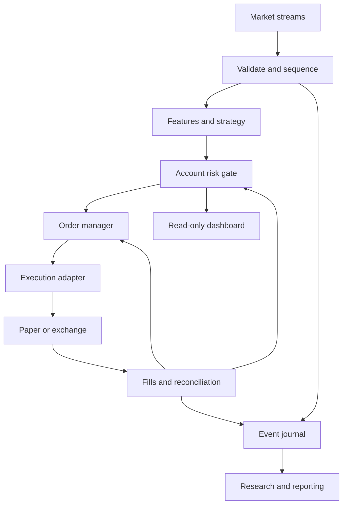

# Advanced Scalping Bot — Engineering Specification and Codex Build Roadmap

Version 1.0 · Prepared 7 September 2026 · Owner: Maruthu Pandi

## 1. Purpose and how to use this file

Build a fast, observable, rules-based crypto scalping research and execution system. Its objective is to discover and preserve positive expected returns after realistic trading costs while controlling losses. This is a specification, not a tested strategy, completed bot, investment recommendation, or promise of high profitability. A technically excellent bot can lose money when its strategy has no edge.

Save this file in the project as `SPEC.md`. Give Codex the master prompt in section 24. Implement one milestone at a time, using the acceptance gates below. Do not ask Codex to generate the entire production system in one unverified pass. Existing repository code must be inspected before modification; preserve working features and adapt this specification to the actual project.

This document includes research hypotheses, proposed engineering defaults, and externally documented exchange requirements. Numerical strategy parameters and promotion thresholds are starting specifications, not proven profitable settings. No exchange keys, account access, or existing repository were inspected for this document.

### Assumptions to verify during discovery

- Initial market: Binance USDⓈ-M linear perpetual contracts, subject to the operator's account eligibility and actual product availability. Keep an exchange adapter boundary so another venue can be used.
- Candidate universe: ETHUSDT, SOLUSDT, DOGEUSDT. Do not add BTC or any other instrument automatically. Confirm that each instrument is active and supported using exchange metadata.
- Python backend and optional Next.js dashboard; laptop development, optional Oracle VM runtime, optional Vercel dashboard, optional Supabase persistence.
- No LLM or OpenAI API key is required for the trading loop. Optional language-model analysis stays outside order execution and cannot change risk limits.
- First deliverable: deterministic replay plus paper trading. Testnet verifies API mechanics. Any production trading deployment is a separate operator-controlled activity; this build request does not authorize starting live trading.
- Design for retail scalping with seconds-to-minutes holding periods. Do not describe this as exchange-colocated high-frequency trading or promise submillisecond exchange execution.

### Glossary

| Term | Meaning |
|---|---|
| Basis point / bps | 0.01%; 10 bps = 0.10% |
| Spread | Best ask minus best bid |
| Slippage | Difference between a chosen reference price and actual execution price |
| Maker / taker | Order that supplies resting liquidity / consumes available liquidity |
| Notional | Quantity multiplied by price for the linear contracts assumed here |
| Margin / leverage | Collateral allocation / ratio of exposure to collateral |
| Drawdown | Equity decline from its preceding peak |
| R | Planned monetary risk on a trade; it is not guaranteed maximum loss |
| Out of sample | Data not used to choose a strategy or its parameters |
| Reconciliation | Comparing internal records with exchange orders, fills and positions |
| Hot path | Time-sensitive processing from an incoming market event to an order decision |
| Fail closed | Block new exposure when a required safety condition is uncertain |

## 2. Success definition and exclusions

Success is measured on four independent dimensions:

1. Correctness: no unintended duplicate orders, no future-data leakage, reproducible replay and accurate accounting.
2. Risk: every exposure change passes limits; failures block entries; losses and inventory remain visible during disconnects.
3. Performance: latency and resource usage are measured on the target machine, under normal and burst traffic.
4. Economic evidence: locked out-of-sample and forward paper results remain positive after credible costs and uncertainty analysis.

Do not optimize for a daily profit promise, a target such as turning $2 into $20, high win rate alone, maximum leverage, or maximum trade count. A no-trade day is valid. Very small balances can be incompatible with minimum order sizes and conservative risk sizing; return `INSUFFICIENT_CAPITAL_FOR_RULES`, never increase leverage or round quantity upward to force an order.

Out of scope for the first release: martingale, unlimited grids, averaging down, latency arbitrage, market making with unmodeled queue priority, reinforcement learning, self-modifying production code, Kubernetes, multi-exchange routing, social-media sentiment and a mandatory LLM.

## 3. Architecture

Use one engine process with isolated per-symbol state and a single account-level risk owner. Put heavy research in a separate process. Keep UI availability irrelevant to order and position management.



### Module responsibilities

| Module | Responsibility |
|---|---|
| `market_data` | WebSocket ingestion, snapshots, sequence checks, trade and candle normalization |
| `features` | Incremental rolling statistics, indicator warmup, feature availability times |
| `strategies` | Pure functions producing intentions with reason codes; no exchange calls |
| `risk` | Account-wide exposure reservations, sizing, health vetoes, trading halts |
| `execution` | Adapter contracts, order state machine, reconciliation, retry classification |
| `portfolio` | Fill-derived inventory, equity, fees, funding and realized/unrealized PnL |
| `storage` | Durable intent journal, event archive, snapshots, asynchronous reporting writes |
| `replay` | Virtual clock, event ordering, simulated exchange and repeatable experiment runs |
| `research` | Walk-forward testing, experiments, cost sensitivity and promotion reports |
| `api` | Authenticated operational views and carefully scoped commands |
| `ops` | Health, metrics, structured logs, restart recovery and alerts |

Suggested dependencies: a supported Python version compatible with target hardware, asyncio, a maintained WebSocket client, httpx, Pydantic, pytest, Hypothesis, Ruff, mypy, DuckDB and PyArrow. FastAPI and PostgreSQL support the control plane. Pin exact verified versions in a lockfile during implementation; do not assume a version in this document is current. Docker is optional. Introduce Rust only if profiling identifies a Python bottleneck that matters economically.

Do not put Supabase calls, HTTP requests, pandas recomputation, LangGraph steps, model inference, or dashboard updates in the market-event decision path. A small local durable journal is intentionally allowed before order submission: durability is more important than removing its measured latency.

## 4. Operating modes and isolation

| Mode | Data | Orders | Purpose |
|---|---|---|---|
| Replay | Recorded or explicit synthetic fixtures | Simulated | Deterministic correctness and research |
| Paper | Public live market data | Simulated | Forward observation of timing and costs |
| Testnet | Venue test environment | Testnet only | Authentication, order states and recovery |
| Shadow | Public production data; optional read-only account | None | Compare planned decisions against market outcomes |
| Live | Production | Real | Separate operator deployment after review |

Default to paper. Mode selection must not silently fall back to live. Paper mode must work without credentials and must never instantiate the live trading adapter. Separate hosts, credentials, databases or namespaces, order ID prefixes, and visible dashboard badges by mode. Testnet prices and fills are not evidence of production profitability.

Keep live execution disabled in default configuration and automated tests. A config typo, missing testnet URL, UI refresh, reboot, or resumed Codex session must never arm live trading. The specification may be used to implement production adapter code, but verification in this build is confined to mocks, public data and testnet with appropriately supplied credentials.

## 5. Market data contract and quality

Every normalized event carries `schema_version`, `event_id`, `venue`, `symbol`, `event_type`, `exchange_time_utc`, `received_time_utc`, `received_monotonic_ns`, sequence information where available, and a typed payload. Monetary values use decimal or integer tick/lot units at exchange boundaries. Floating point is acceptable for indicators with explicitly tested tolerances, not exchange rounding or cash accounting.

Subscribe to supported best-bid/ask, trades, depth and candle streams as required by the selected strategy. Start with quotes, trades and closed candles; depth-dependent signals remain disabled until correct depth reconstruction exists. Fetch symbol rules at startup and refresh on a schedule and relevant exchange errors. Validate symbol status, tick size, lot step, minimum quantity/notional, maximum quantity, applicable order constraints and current limits. Do not use displayed precision as a substitute for tick or step size. [S1]

For a local depth book, follow the venue's snapshot-and-delta sequence procedure exactly. Buffer stream messages while fetching the snapshot, align the first applied event, reject broken continuity, and rebuild when continuity is lost. Apply quantities according to documented semantics rather than interpreting absolute sizes as increments. Mark the symbol unhealthy throughout resynchronization. [S2]

Implementation requirements:

- Distinguish duplicates, late events, gaps and genuine out-of-order events. Never silently reorder account events without a documented rule.
- Use a monotonic clock for durations. Record wall-clock offset separately; exchange timestamps alone cannot prove one-way network latency.
- Build 1m candles from the chosen authoritative feed, and use only completed bars for bar-based signals. Maintain 5m/15m context using bars available at decision time.
- Emit warmup state; never replace missing indicator history with zero.
- Archive raw received events and normalized events with schema and code version. Mark missing periods explicitly.
- Store instrument metadata snapshots with replay datasets. Historical tests must use applicable historical rules or disclose unavailable metadata.
- Reconnect with bounded exponential backoff and jitter. Respect documented heartbeat, session lifetime and subscription limits; recheck these at build time.
- A quote can be coalesced for a quote-only view. Never discard depth deltas or fills and continue as if the stream were complete.
- If the recorder cannot retain research-quality data, mark the interval unusable. If account events or order intents cannot be retained safely, block new exposure.

## 6. Features and regime classification

Implement features incrementally using bounded ring buffers:

- Midpoint = `(best_bid + best_ask) / 2`.
- Spread bps = `10_000 * (best_ask - best_bid) / midpoint`.
- EMA(9), EMA(21), ATR(14) on closed 1m bars; EMA(20), EMA(50), ATR(14) on closed 5m bars.
- Session or rolling VWAP with its anchor explicitly configured; use a trailing 60-minute trade VWAP for the baseline below.
- Relative volume = last closed 1m volume / mean of the preceding 20 closed 1m volumes, excluding the current bar.
- Depth imbalance = `(bid_size_sum - ask_size_sum) / (bid_size_sum + ask_size_sum)` over a configured price band. Disable when the denominator is zero or the book is invalid.
- Signed trade-flow imbalance over a trailing window, with aggressor classification verified against venue semantics.
- Volatility percentile using trailing observations only, rolling spread percentile, available depth at candidate order size, and recent realized slippage.

Initial regimes: `TREND_UP`, `TREND_DOWN`, `RANGE`, `VOLATILITY_SHOCK`, `ILLIQUID`, `UNKNOWN`. A proposed trend rule is EMA20 above/below EMA50 on 5m bars with matching EMA20 slope over three completed bars. Add a normalized separation threshold, initially 0.10 times 5m ATR, to avoid classifying nearly equal averages as a trend. Range is small separation and low normalized slope; unclassified boundaries remain UNKNOWN. Freeze exact thresholds before evaluation.

Volatility shocks and illiquidity veto all entries. Regime thresholds must use trailing history and be selected on training data. Do not let a regime classifier trained on future data make a backtest appear adaptive.

## 7. Strategy research specifications

These are falsifiable starting hypotheses, not validated sources of profit. Build strategy A first. Compare B and C independently before considering a combined selector. Keep the full count of tested variations.

### A. Trend pullback and recovery

Hypothesis: in a stable trend, a short pullback followed by recovery may offer continuation large enough to cover execution costs.

Initial long setup:

1. Regime is TREND_UP and all data/risk gates pass.
2. Last completed 1m bar has EMA9 > EMA21. Its low touches or falls below EMA9 and its close finishes above EMA9 and above its open.
3. Relative volume on that completed bar is at least 1.10.
4. Within the following 60 seconds, a fresh observed trade crosses above the signal bar high. Evaluate at that event, never retroactively at the bar close.
5. Compute the proposed stop as the minimum low of the three latest closed 1m bars minus 0.10 ATR. Reject if the entry-to-stop distance is below 0.50 ATR or above 1.50 ATR.
6. Calculate size and costs. Produce one expiring entry intent only if the trade passes all checks.

Short conditions mirror the long rule with TREND_DOWN, highs instead of lows, and downward breakout. Trigger data and executable prices are separate: a last-trade crossing does not guarantee an available fill at that price.

Proposed exits: stop at the calculated invalidation price; target at 1.5 times initial price risk; maximum holding time 180 seconds. Fix the target convention explicitly: this multiple is gross price distance; report net realized R separately after costs. Disable trailing stops, partial profit-taking and moving stops to break-even until separate tests justify them. Never widen the original stop to avoid realizing a loss.

Initial research grid: volume threshold {1.0, 1.1, 1.3}, target multiple {1.0, 1.5, 2.0}, time exit {60, 180, 300 seconds}; keep other rules fixed. Register all 27 trials, plus any later exploratory changes. Do not pick a winning combination from the final test set.

### B. Volatility compression breakout

Hypothesis: a breakout following lower recent volatility may continue when accompanied by volume and executable liquidity.

Use the preceding 20 closed 1m bars to define the range. Define compression as ATR14 below the trailing 20th percentile of ATR14 observations over the preceding 24 hours. Enter only after a newly completed bar closes outside the prior range with relative volume at least 1.5; attempt execution at the next eligible event. Stop on the opposite side of the breakout bar, subject to a 0.5–1.5 ATR risk-distance band; use 1.5R gross target and 180-second time exit for initial comparison. Require matching 5m trend and reject shock regimes. All parameters are research placeholders.

### C. Range mean reversion — later experiment

Hypothesis: in demonstrably range-bound conditions, deviations from rolling VWAP can partially revert. Calculate the current completed-bar close deviation against the preceding 60 closed-bar deviation distribution. Trigger only when a prior deviation beyond 2 standard deviations crosses back within that boundary in RANGE regime. Target the rolling VWAP value fixed at entry; stop one ATR from entry; time exit 120 seconds. Reject when target distance is too small after costs. Disable in trend/shock regimes. Do not average down.

### Strategy arbitration

Each strategy returns `NO_TRADE`, `ENTER_LONG`, `ENTER_SHORT`, or `EXIT`, together with feature time, reason codes, strategy version, stop, target and intent expiry. A heuristic score is not a probability of winning. If strategies disagree, default to no trade. Start with only one enabled strategy. No online self-learning or automatic risk escalation.

## 8. Economic model: profitability after costs

For a linear contract with quantity q, entry price Pe, exit price Px, and direction d = +1 for long / -1 for short:

`gross_pnl = d * q * (Px - Pe)`

`net_pnl = gross_pnl - entry_fee - exit_fee + signed_funding_cashflow`

Use actual execution prices in this formula. Their spread and slippage effects are already included; do not subtract these twice. For pre-trade forecasting from midpoint returns, subtract forecast fees, spread crossing, additional impact/slippage, funding where applicable and an uncertainty allowance.

Illustration only, not Binance pricing: if gross expected movement is 20 bps and total forecast round-trip costs are 14 bps, estimated net edge is 6 bps. On $100 notional that is $0.06 before estimation error and fixed infrastructure costs. Leverage does not improve the underlying price edge.

Estimate expectancy as `win_probability * average_net_win - loss_probability * average_net_loss`, using a consistent trade population and explicit handling of flat outcomes. Profit factor is total positive net trade PnL divided by absolute total negative net trade PnL. Report undefined cases honestly. High win rate alone is insufficient.

Cost requirements:

- Obtain actual account commission information when available; otherwise require explicit conservative assumptions and label them.
- Model maker/taker status for every fill, including partial entry and exit fills. Never assume all limit orders are maker fills.
- Simulate spread, depth consumption, queue uncertainty, missed fills, cancellations, delays and adverse price movement.
- Include funding whenever an open position crosses a funding event. Include liquidation rules in leveraged simulation or explicitly prohibit claims that it models leveraged survivability.
- Run base, 1.5x and 2x variable-cost scenarios. Report the break-even fee/slippage boundary.
- Keep fixed server/data costs separate from trade expectancy and include them in monthly business-level net results. Taxes are not estimated by this engineering model.
- An estimated edge filter may use only a frozen out-of-sample-calibrated estimator. Before such an estimator exists, do not fabricate confidence or expected returns; use explicit cost feasibility rules and label the model provisional.

## 9. Account risk and sizing

Proposed paper defaults, for testing rather than personalized capital advice:

| Setting | Initial value |
|---|---|
| Risk budget per trade | 0.25% of current marked equity |
| Aggregate planned stop risk | 0.50% of marked equity |
| Concurrent positions | 1 account-wide |
| Gross notional cap | 100% of marked equity |
| Leverage simulation default | 1x |
| Daily equity-loss halt | 1.0% of start-of-day equity, adjusted for external flows |
| Peak drawdown halt | 5.0% from persisted equity high-water mark |
| Consecutive-loss pause | 3 completed losing trades; 30-minute minimum pause |
| Re-entry cooldown | 60 seconds per symbol after an exit |
| Quote age veto | 1,000 ms; calibrate using observed feed behavior |
| Maximum spread | 5 bps initial research veto; validate per instrument |
| Entry intent lifetime | 500 ms from decision |

Sizing for a linear base-quantity instrument:

`risk_cash = equity * risk_fraction`

`risk_per_unit = abs(entry - stop) + conservative_per_unit_cost_allowance`

`raw_qty = risk_cash / risk_per_unit`

Then cap by remaining aggregate risk, gross notional, available margin plus buffer, liquidity participation and venue limits. Round quantity DOWN to the lot step. Recompute expected risk after all price/quantity rounding. Reject if below the applicable minimums. Model entry/stop slippage in the allowance; a stop cannot guarantee maximum loss during gaps or outages.

Risk is account-wide across ETH, SOL and DOGE; do not treat correlated positions as independent. Reserve capacity atomically for pending orders before releasing a decision. Partial fills consume risk immediately, and unfilled remainders retain reservations until their final state is known. Reserve by worst plausible fill, not merely current inventory.

Daily limits use realized plus unrealized PnL, fees and funding; external deposits cannot erase trading losses. Define UTC day boundaries, persist the reference equity, and never reset a halt on process restart. A daily boundary is not permission to clear a drawdown or unresolved-order halt.

Each entry must pass: healthy feeds, synchronized book if required, warmed features, active symbol, fresh intent, spread/depth thresholds, valid stop, positive size, exchange filters, adequate collateral, risk reservation, no conflicting orders, no halt and durable journal availability. Record every rejection reason.

## 10. Execution state machine and safety invariants

Order states: `CREATED`, `PERSISTED`, `SUBMITTING`, `ACKNOWLEDGED`, `PARTIALLY_FILLED`, `FILLED`, `CANCEL_PENDING`, `CANCELED`, `REJECTED`, `EXPIRED`, `UNKNOWN`. UNKNOWN is unresolved, not a terminal rejection. State transitions must accept duplicate events idempotently and late fills during cancellation.

Persist a unique client order ID and intent before any submission. Link every venue order ID, execution ID, fill, cancel attempt and position change to that intent. Do not assume an order acknowledgment means a fill. Binance documents ambiguous execution outcomes for some errors: query order status and reconcile with account events before resubmission. Rate-limit responses require documented backoff and budget handling. [S3]

Required execution behavior:

1. Validate, reserve risk and persist intent.
2. Submit once using the adapter's supported method and measured timeout.
3. On known rejection, release only the unfilled reservation and record the reason.
4. On timeout or ambiguous result, mark UNKNOWN, block conflicting exposure, query by identifiers and reconcile. Never blind-retry an order just because the HTTP response is missing.
5. Process fills idempotently and update inventory, cash, fees and protections immediately.
6. On partial fill, protect actual filled quantity; manage the remainder independently.
7. A cancel request is not a cancel confirmation. Continue processing fills until reconciliation establishes the result.
8. On restart, reconcile open orders, positions and recent fills before enabling entries.

Default entry policy for research: marketable limit with an explicit worst acceptable price and supported immediate-or-cancel semantics. This caps the limit price but may miss or partially fill. Validate exact venue/order-type support during adapter implementation. Passive post-only entry is a separate policy with a modeled queue, expiry and adverse-selection analysis. Do not assume maker execution is free or better.

Protective exits require an adapter capability matrix: native conditional order support, trigger-price reference, reduce-only behavior, position-mode compatibility, conditional-order lifecycle and partial-fill handling. Verify current endpoints rather than copying old examples. Start with one-way position mode as an explicit assumption. Never toggle account position or margin mode silently.

In production design, protective orders should remain at the venue when supported. If protection cannot be confirmed within the configured deadline, block entries and invoke the preconfigured emergency procedure. Canceling every order must not remove the only protection while leaving exposure open.

Account states: `STARTING`, `RECONCILING`, `READY`, `PAUSED`, `HALTED`, `DEGRADED`, `STOPPING`. Only READY can create new exposure. Exits and reconciliation remain available in paused/degraded states where technically possible.

Separate commands: pause entries; cancel unfilled entry orders; request flatten; emergency halt. Define flatten as cancel/reconcile entry remainders, submit risk-reducing closes where possible, then verify flatness before removing obsolete protections. Unknown execution or venue outage means flatness is unconfirmed, not successful.

## 11. Durable state and accounting

Use a local append-only intent/event journal or transactional SQLite WAL initially. Put cold research data in partitioned Parquet and query it with DuckDB. PostgreSQL/Supabase can receive batched operational records; a remote database should not be required for each market update. The local journal must survive process restarts and support disk-full handling.

Minimum persisted entities:

| Entity | Required fields |
|---|---|
| `runs` | run_id, mode, git_commit, config_hash, dataset_id, start/end, status |
| `intents` | intent_id, strategy_version, symbol, side, size, stop, expiry, risk reservation |
| `orders` | client_id, venue_id, intent_id, state, submitted/updated times, cumulative fill |
| `fills` | unique venue execution identity, order_id, price, quantity, commission asset/amount, time |
| `positions` | symbol, signed quantity, entry basis, realized PnL, protection references |
| `equity_snapshots` | cash, marked inventory, fees/funding, equity, high-water mark |
| `risk_events` | limit name, observed value, threshold, action, actor, reason |
| `experiments` | hypothesis, split dates, parameters, trial number, metrics, promotion decision |
| `data_manifests` | source, covered intervals, gaps, schema, metadata snapshots, checksums |

Unique fill keys must include the venue/account/symbol scope required by actual ID semantics. Partial fills are not independent strategy wins. Group fills into completed position episodes for strategy metrics. Reconcile fees paid in other assets through a timestamped conversion method and disclose valuation gaps.

Create recovery snapshots from the journal, retaining enough preceding events to replay safely. A snapshot is an optimization, not the authority over the exchange. Persist halt state and config history. Implement schema migrations and a restore drill, not just a backup command.

## 12. Backtesting and realistic simulation

Share strategies, risk checks and normalized event types between replay and paper. Inject a clock and execution adapter; do not fork business rules into an unrelated backtester. Identical dataset, config, code and random seed must reproduce the same output.

### Data fidelity levels

1. OHLCV bars: useful for early idea rejection; inadequate to validate spread-sensitive or queue-dependent scalping.
2. Timestamped trades and quotes: useful for event-triggered entry and spread-aware fills; still limited for market impact.
3. Depth snapshots and valid deltas: supports depth consumption estimates; public depth still does not reveal exact queue position.

Do not synthesize historical order-book imbalance from candles. If suitable historical data is unavailable, collect it and label early bar-based results preliminary.

Simulation requirements:

- Enforce feature availability times and order delays. A decision cannot fill against liquidity that disappeared before simulated order arrival.
- Model network/processing delay from distributions and stress scenarios, with deterministic seeded randomness.
- Marketable buys consume asks and sells consume bids; honor size/depth limits and partial fills.
- Resting-limit fills require a documented conservative queue assumption. A candle touching a limit price is not proof of a fill.
- If both stop and target fall inside one unresolved bar, use an explicitly conservative path assumption or mark the trade ambiguous. Never automatically choose the profitable order.
- Handle tick/lot rounding, reject rules, cancels, stale signals, spread spikes, gaps, funding and adverse fills on stops.
- Disclose unavailable exchange mechanics. Testnet fill quality cannot calibrate production queue priority.

### Validation protocol

Reserve a final untouched chronological test interval before trying parameters. Use rolling walk-forward training/validation windows on the earlier data; for example, 60 days train and 14 days validate if sufficient data exists. The example is not a minimum evidence guarantee. Include different volatility and trend regimes.

Purge overlapping outcome horizons at split boundaries; add an embargo appropriate to the longest label/holding horizon. Historical observations before the boundary may warm indicators, but fitting, selection and labeled outcomes cannot leak into the validation interval. Normalize and fit models using training data only.

Register all parameter trials, including abandoned experiments. Multiple searches can select lucky historical winners; Bailey et al. analyze this backtest-overfitting problem. Use limited prespecified grids, parameter-neighborhood stability and multiple-testing-aware diagnostics when the experiment history supports them. [S4]

Estimate uncertainty with block bootstrap by day/session or another justified block length, preserving temporal dependence better than shuffling individual trades. Report median and adverse quantiles for drawdown, net expectancy and equity paths. A simulated ruin estimate is conditional on the data/model and cannot establish safety.

### Required report

Gross and net PnL; fees/funding; turnover; trade count; exposure time; win rate; average win/loss; expectancy; profit factor; max drawdown and duration; worst day; fill/miss/cancel ratios; slippage distribution; latency percentiles; performance by symbol/regime/time bucket; cost stress; parameter stability; data gaps; all trials and selected version.

Calculate Sharpe/Sortino from consistently sampled net equity returns, not by annualizing a per-trade win series. State sampling, annualization, zero-return periods and dependence limitations. Short samples can produce misleadingly large ratios.

## 13. Promotion gates

These are proposed review gates, not proof of future profit. Freeze them before final validation; record any later changes as a new research cycle.

| Gate | Required evidence |
|---|---|
| Correctness | Critical invariants and recovery tests pass; deterministic replay |
| Data | Gaps identified; required features have suitable source data |
| Economics | Positive final out-of-sample net expectancy; report uncertainty and all costs |
| Uncertainty | Proposed 95% block-bootstrap lower expectancy bound above zero, or remain in research |
| Robustness | Positive net result at 1.5x variable costs; disclose 2x failure boundary |
| Concentration | Show whether one symbol/day/trade dominates profit; investigate fragility |
| Drawdown | Historical and stressed losses within the predefined paper risk budget |
| Forward paper | At least 30 calendar days and 300 completed trades, whichever takes longer, plus adequate regime coverage |
| Execution | Testnet state/recovery tests pass; paper fill assumptions documented |
| Operations | Restart, disconnect, disk-full, unknown-order and protection-failure drills pass |
| Deployment | Independent operator review; explicit capital/limits and production configuration |

The 30-day/300-trade floor is an engineering observation minimum, not statistical sufficiency. Correlated trades, narrow regimes or wide uncertainty require more evidence. Do not relax gates or manufacture extra trades to reach a count. If the strategy fails, deliver the failure report and retain paper mode.

## 14. Speed and performance specification

Separate internal compute latency from network and exchange latency. Timestamp receive, decode, feature complete, strategy complete, risk complete, journal commit, submission, acknowledgment and fill. Measure local intervals with monotonic time. Exchange matching/fill time is outside the application's control.

Initial engineering objectives on a declared target machine:

| Metric | Proposed target |
|---|---|
| Decode → feature/decision/risk, excluding disk/network | p95 ≤ 10 ms, p99 ≤ 25 ms |
| Event-loop scheduling lag | p99 ≤ 20 ms under expected load |
| Intent durability | Measured p95/p99; provisional p99 ≤ 20 ms on local SSD |
| UI freshness | About 1 second; never a trading dependency |
| Sustained load | 2x measured normal input without correctness loss |
| Burst load | 5x observed normal for 60 seconds; bounded queues or explicit safe degradation |
| Memory | Bounded during a 24-hour soak; report target-machine footprint |

These are acceptance objectives to benchmark, not guaranteed performance. Report hardware, OS, Python/dependency versions, dataset, event rate, sample count and whether disk durability was enabled. Do not claim “fast” using averages alone.

Optimization order: measure → eliminate blocking I/O → incremental features → bounded queues → batch cold writes → isolate research/UI → optimize parsing/allocation → profile a compiled component only if still needed. Reuse connections, honor rate limits and avoid candle polling for tick-level decisions. Never remove risk checks, persistence, sequence validation or reconciliation to meet a latency target.

A remote server may improve availability, but exchange round trips must be measured from that actual region. Do not assume Oracle Hyderabad, a free VM or a faster programming language guarantees better fills. A 1 GB host may require disabling research/UI locally and reducing recording workload; capacity must be measured before deployment.

## 15. Tests and failure injection

Financial state transitions need meaningful tests. Avoid tests that simply copy formulas from the implementation without independent expected outcomes.

Mandatory fixtures and properties:

- Tick/lot rounding and minimum order boundaries; quantity never exceeds risk after rounding.
- Long and short accounting with multiple fills, fees, funding and partial exits; reconcile to a hand-calculated ledger.
- Future-data sentinel: changing future events cannot change earlier decisions.
- Repeat replay produces identical decisions and accounting.
- Duplicate fill events change inventory once; replaying all events twice cannot double PnL.
- Two simultaneous symbol signals cannot exceed the account reservation cap.
- Submission accepted but response lost; restart recovers the original order without duplicate submission.
- Cancel/fill race, fill after cancel request, partial fill then disconnect, and delayed account events.
- Depth gap triggers rebuild and blocks dependent signals.
- Quote staleness, clock jump, rate limiting and session disconnect trigger correct degradation.
- Failed protective order leaves a visible unresolved risk state; it cannot show “protected.”
- Disk full or journal failure prevents new orders, while the emergency path remains observable.
- Halt and high-water mark survive restart; day rollover cannot clear unrelated halts.
- Paper mode with production-looking environment variables still cannot call a live trade endpoint.
- Dashboard restart and database reporting outage do not stop existing position management.

Use unit tests for pure rules, property-based tests for invariants, recorded adapter-contract tests for schemas, deterministic integration tests for recovery, and bounded load/soak tests for performance. CI uses mocks and fixtures with no production credentials. Add testnet tests as an explicit separate suite.

## 16. API, dashboard and operator controls

Start with a CLI and structured logs. Add a dashboard after paper correctness. Suggested FastAPI contract:

| Endpoint | Behavior |
|---|---|
| `GET /health/live` | Process is responsive |
| `GET /health/ready` | Engine readiness with blocking reasons |
| `GET /v1/status` | Mode, run/version, risk state, feed ages |
| `GET /v1/positions` | Inventory, marks, protection confirmation |
| `GET /v1/orders` | Known and unresolved orders |
| `GET /v1/performance` | Net accounting, drawdown, cost and fill statistics |
| `GET /v1/risk/events` | Limit breaches and entry vetoes |
| `POST /v1/control/pause` | Idempotently block entries |
| `POST /v1/control/resume` | Resume only after readiness and authorized checks |
| `POST /v1/control/flatten` | Explicit scoped request, audited and reconciled |

Control endpoints require authentication, authorization, request IDs, audit logging, input validation and protection against cross-site requests where browser cookies are used. No mutation through GET. Do not expose an unauthenticated engine port to the internet. Browser clients never receive exchange secrets. Use a control-plane command queue with acknowledgment rather than mutating engine state from arbitrary request handlers.

Dashboard views: mode badge, net equity, drawdown, risk remaining, feed/book health, open positions and stops, unresolved orders, entry rejection reasons, strategy version, latency percentiles, recent fills and cost assumptions. Clearly distinguish pending flatten from confirmed flat. Avoid “AI confidence” or fabricated profit projections.

## 17. Security, deployment and operational runbook

Secrets belong in local environment/secret configuration, never source code, frontend bundles, logs, screenshots or this file. Use least-privilege credentials, no withdrawal permission, separate environments and supported IP restrictions. Do not ask the user to paste secrets into chat. Read-only account integration should use read-only credentials.

Package engine, research and dashboard separately. On a server, use a process supervisor such as systemd or a documented container restart policy, persistent storage and a single active engine owner. Prevent duplicate execution with a process/account lock; any distributed failover requires fencing that actually prevents the old process from submitting, not merely an expiring lease.

Startup: validate config → acquire ownership → open journal → load persisted halt → establish data → refresh metadata → reconcile orders/fills/positions → warm features → verify protections → enter READY only when all checks pass. Default after an unexpected crash is paused until reconciliation completes.

Normal shutdown: block entries → resolve/cancel pending entries → follow configured inventory policy → persist/checkpoint → stop only after stating the remaining position/protection status. Never hide a non-flat shutdown behind a successful exit code.

Daily operations: review unresolved events, net costs, slippage drift, feed quality, disk space, backups and configuration changes. Weekly: compare observed and modeled fills, review drift and recover a backup in a nonproduction environment. Retention periods depend on disk budget; start with configurable raw-data retention and preserve immutable experiment datasets and audit events needed to reproduce decisions.

Incident responses:

- Data unhealthy: pause entries, rebuild data, retain risk monitoring.
- Order outcome unknown: reserve worst-case exposure, reconcile, escalate if unresolved.
- Local disk failure: halt entries; keep protection/reconciliation path alive if possible.
- Exchange unreachable: stop submission attempts that could duplicate exposure; surface uncertainty and rely on already-confirmed venue protections where available.
- Unexpected position: reconcile ownership and halt; do not silently adopt it into a strategy.
- Strategy deterioration: disable candidate; return to research using a new version. Do not increase leverage to recover losses.

## 18. Optional learning and advanced features

Add capabilities only when simpler versions have measurable limitations. Start with execution-cost calibration, then a better volatility/regime filter, then supervised trade-quality ranking if there is enough labeled data. A small model is acceptable without an LLM. Compare it against the rules-only baseline out of sample.

Store feature snapshots as available at decision time and label outcomes only after their horizon completes. Train offline. Evaluate champions and challengers against fixed risk/cost assumptions. Run challengers in shadow mode. Promote only after a reviewed report and retain one-step rollback. Never let a model edit its own risk limits, production code, credentials or promotion gates.

Optional LLM role: summarize logs or help a human investigate failures using redacted data. It does not sit between price updates and orders, supply guaranteed probabilities, or serve as a required 24/7 dependency.

## 19. Repository layout

```text
scalper/
  SPEC.md
  README.md
  pyproject.toml
  dependency-lockfile
  .env.example
  configs/
    paper.yaml
    replay.yaml
    testnet.example.yaml
  src/scalper/
    domain/       # typed events, money, clock, IDs
    market_data/  # feeds, sequencing, book, candles
    features/     # incremental indicators
    strategies/   # pure intentions and versions
    risk/         # reservations, limits, health gates
    execution/    # adapters, order FSM, reconciliation
    portfolio/    # fill ledger and equity
    storage/      # journal, snapshots, archival
    replay/       # virtual clock and simulated exchange
    research/     # experiments and reports
    api/          # authenticated control plane
    ops/          # health, metrics, startup/shutdown
    cli.py
  tests/
    unit/
    properties/
    contracts/
    integration/
    failure_injection/
  fixtures/
  scripts/
  docs/
    progress.md
    architecture.md
    runbook.md
    exchange-capabilities.md
  reports/
  dashboard/      # optional Next.js application
```

The lockfile name must match the selected package manager. Generated raw market data and secrets do not belong in Git. Store dataset manifests and reproducibility metadata in version control where appropriate.

## 20. Example configuration contract

This YAML is a proposed schema to implement, not a runnable exchange configuration. Every field must be parsed, validated and consumed by code; reject unknown keys. Risk percentages below are fractions.

```yaml
schema_version: 1
mode: paper
symbols: [ETHUSDT, SOLUSDT, DOGEUSDT]
execution:
  live_enabled: false
  entry_policy: marketable_limit_ioc
  intent_ttl_ms: 500
  protection_ack_deadline_ms: 2000
  position_mode: one_way
risk:
  per_trade_equity_fraction: 0.0025
  aggregate_stop_risk_fraction: 0.005
  gross_notional_equity_multiple: 1.0
  max_positions: 1
  leverage_cap: 1
  daily_equity_loss_fraction: 0.01
  peak_drawdown_fraction: 0.05
  consecutive_loss_pause_count: 3
  pause_minutes: 30
  symbol_cooldown_seconds: 60
market:
  max_quote_age_ms: 1000
  max_spread_bps: 5.0
  require_valid_book: true
strategy:
  enabled: [trend_pullback_v1]
  relative_volume_min: 1.1
  target_gross_r: 1.5
  max_hold_seconds: 180
costs:
  source: explicit_assumptions
  entry_fee_bps: null
  exit_fee_bps: null
  additional_slippage_bps: null
  uncertainty_buffer_bps: null
storage:
  journal_path: data/runtime/journal.db
  archive_path: data/market
```

Null cost fields intentionally block research claims and paper execution until supplied. The discovery phase must supply clearly labeled illustrative values for fixtures and a separate operator-selected paper cost scenario; never silently convert null to zero. Validate that protection deadlines and feed-age limits are compatible with measured venue behavior. A config value alone does not implement a feature.

## 21. Build roadmap with deliverables and exit gates

Effort estimates assume a developer supervising Codex and vary with repository quality. Calendar time for data collection and forward validation cannot be compressed by generating code faster. A 4–8 week initial engineering effort is a planning estimate, followed by the evidence period, not a delivery or profit guarantee.

### Phase 0 — Repository discovery and requirements, 0.5–1 day

Inspect existing code, instructions, environment and tests. Map reusable components to this specification. Confirm instruments, market type, runtime resources and account-independent data access. Record assumptions, dependency choices and unsupported features. Deliver architecture notes, prioritized backlog and a migration plan. Gate: no invented implementation status and no destructive rewrite.

### Phase 1 — Foundation and contracts, 1–2 days

Create package, configuration validation, clocks, typed domain events, IDs, structured logs, CI and paper-only CLI. Add secret-free fixtures. Gate: clean installation; invalid/live-default configs rejected; deterministic fixture run.

### Phase 2 — Market ingestion and recorder, 2–4 days

Implement metadata loading, streams, sequencing, candle close semantics, gaps and archival. Gate: 24-hour public-data collection with a quality report; induced disconnect recovers without silent gaps.

### Phase 3 — Portfolio, risk and journal, 2–4 days

Implement fill ledger, risk reservations, limits, persisted halts and restart snapshots. Gate: independent accounting fixtures and simultaneous-signal risk tests pass.

### Phase 4 — Replay and paper exchange, 3–5 days

Implement virtual clock, cost model, delayed/partial fills, cancel races and reproducible reports. Gate: replay equality and future-data sentinel pass; simulator limitations documented.

### Phase 5 — Strategy A baseline, 1–3 days

Implement exact features, entry/exit rules, reason codes and finite parameter grid. Gate: hand-audited fixture decisions and net-cost report, even if losing.

### Phase 6 — Research and rejection loop, 3–7 days initially

Run registered walk-forward experiments, cost stress, uncertainty and final locked test. Add B/C only as separate hypotheses. Gate: report accepted/rejected/inconclusive honestly; no live advancement on failure.

### Phase 7 — Live-data paper service, 2–4 days setup plus observation

Run public-data paper mode with monitoring and runtime metrics. Compare model fills to executable quotes and measured delays. Gate: forward observation minimum and economic gates; recording outages extend the period where needed.

### Phase 8 — Adapter mechanics and recovery, 3–5 days

Implement verified current exchange contracts and run mock/testnet tests, including conditional protection, ambiguous submissions and restart. Gate: no duplicate exposure and complete capability matrix. Do not activate production trading.

### Phase 9 — Performance and operational hardening, 2–4 days

Profile the full durable path; test bursts, soak, disk failure and restore. Gate: benchmark report or explicit unresolved bottleneck; no unsafe optimization.

### Phase 10 — Dashboard and packaging, 2–4 days

Implement authenticated status/control views, deployment files and runbook. Gate: dashboard/database outage leaves engine risk management functional; secrets stay server-side.

### Phase 11 — Operator review package, 1–2 days

Deliver locked code/config versions, all experiments, data limitations, economic results, test evidence, recovery procedures and unresolved issues. Gate: reviewer can reproduce conclusions. Default deployment stays paper; future real-money operation requires a separately reviewed production setup.

### Phase 12 — Advanced research, only after a justified baseline

Consider execution-cost prediction, regime improvements, trade-quality classifiers and shadow challengers. Gate: incremental net improvement on untouched data without worse operational/risk outcomes. Reject complexity without evidence.

## 22. Intended developer commands

Codex must implement and document these interfaces or explicitly update the specification with an equivalent consistent CLI. They do not exist merely because they appear here.

```bash
python -m scalper doctor --config configs/paper.yaml
python -m scalper record --config configs/paper.yaml --duration 24h
python -m scalper replay --config configs/replay.yaml --dataset DATASET_ID
python -m scalper research walk-forward --experiment EXPERIMENT_ID
python -m scalper paper --config configs/paper.yaml
python -m scalper report --run RUN_ID
python -m scalper benchmark --dataset DATASET_ID
python -m scalper status
python -m scalper pause --reason operator_review
pytest
ruff check .
mypy src
```

`doctor` must report mode, dependency/runtime health, public-data reachability, metadata/filter availability, configured costs, journal writability and blocking conditions. It must not test production order placement. No live-start command is included in this handoff.

## 23. Definition of done

- Runnable paper bot and reproducible replay, not only folders, TODOs or a dashboard mockup.
- Complete cost-aware accounting and visible no-trade reasons.
- Risk reservations, durable order identities and restart reconciliation are implemented and tested.
- A documented simulator with no claimed queue/latency fidelity it does not possess.
- No LLM dependency in trading decisions; no production secrets in code.
- Passing critical tests with exact commands and actual results recorded.
- Benchmark results from a named environment, not invented performance claims.
- Strategy report with all trials and an explicit accepted/rejected/inconclusive conclusion.
- Operator instructions for starting/stopping paper mode, troubleshooting and restoring state.
- Default configuration and delivery remain paper-only, even if research looks profitable.
- Missing data, credentials, unsupported venue features and failed gates are clearly disclosed.

## 24. Master prompt to give Codex

Copy the following prompt and attach this entire file, or place it in the repository as `SPEC.md`.

```text
You are the engineering implementer for the project described in SPEC.md.
Build a fast, rules-based crypto scalping system, beginning with deterministic
replay and paper trading. Treat SPEC.md as the product and acceptance contract.
Do not promise profit or invent measured results.

FIRST ACTIONS
1. Read repository instructions and SPEC.md. Inspect existing source and tests.
2. Identify reusable code, actual gaps, incompatible assumptions and current
   runtime/dependency constraints. Preserve working code and user changes.
3. Write docs/progress.md containing a phase checklist, concrete next milestone,
   acceptance commands, open issues and evidence links.
4. Verify current official venue documentation for any API being implemented.
   Record capability and schema assumptions in docs/exchange-capabilities.md.
5. Implement the earliest incomplete milestone. Do not stop at a plan when you
   can implement and verify authorized paper/replay work.

NON-NEGOTIABLE CONSTRAINTS
- Default paper mode. Do not launch autonomous real-money trading, place live
  orders, or modify account leverage/margin/position settings.
- No LLM in the execution loop and no OpenAI API key requirement.
- Universe starts with ETHUSDT, SOLUSDT, DOGEUSDT; verify venue availability.
- Use event-driven processing, bounded memory, explicit health states,
  account-level risk reservations, durable intents and reconciliation.
- Strategies never call exchange APIs directly. Risk may veto every entry.
- Never blind-retry ambiguous order submissions. Persist identifiers first.
- Account for partial fills, cancels, fees, funding and delayed events.
- Never round upward to satisfy minimum order size or increase leverage to
  force a trade. Reject infeasible capital/size combinations.
- All strategy settings are research hypotheses. Freeze experiment splits,
  retain all trials, prevent leakage and report results after realistic costs.
- Do not equate paper/testnet fills with proof of real-world profitability.
- No martingale, revenge sizing, uncontrolled averaging down or self-editing
  production strategies. Optional learning is offline and versioned.
- Do not put network databases, dashboard rendering or heavy research in the
  time-sensitive decision path. Do not remove durability to improve benchmarks.
- Never read or print secrets unnecessarily. Keep examples credential-free.
- Do not claim commands, features, tests or benchmarks exist until implemented
  and actually run. Clearly label blockers and partial implementation.

WORKFLOW FOR EACH MILESTONE
A. Define the smallest complete deliverable and its meaningful acceptance tests.
B. Implement it using shared domain contracts and consistent configuration.
C. Run applicable tests and repair failures; record real commands/results.
D. Update docs/progress.md with completed work, evidence, blockers and next step.
E. Provide a concise handoff: what changed, how verified, how to run it, remaining
   limits. Continue through feasible authorized work without repeated permission
   questions; stop only at a real blocker or a separate action requiring approval.

DELIVERY
Provide runnable code, pinned dependencies, fixture data, documented CLI,
configuration examples, paper reports, test/benchmark evidence and runbook.
If a strategy fails validation, keep paper mode and explain the evidence.
Do not tune on the final test interval or change gates to manufacture success.

Begin now with repository discovery and the earliest incomplete phase.
```

### Continuation prompt

```text
Read SPEC.md and docs/progress.md. Inspect the current implementation and actual
test evidence. Continue the earliest incomplete milestone; do not restart the
project or repeat completed work. Preserve paper-only operation. Implement,
verify and update the progress log with concrete evidence and the next step.
```

### Independent review prompt

```text
Review this repository against SPEC.md. Focus on future-data leakage, false fill
assumptions, double-counted or missing costs, race conditions, duplicate orders,
partial fills, protection failure, restart safety, risk-limit bypasses and mode
isolation. Cite concrete source locations and reproducible failure cases.
Distinguish implemented safeguards from configuration fields and TODOs. Do not
place orders or enable live mode. Prioritize findings by actual financial and
operational impact. State which acceptance gates have evidence and which do not.
```

## 25. Sources and verification boundaries

Official technical references checked on 7 September 2026. Links may redirect as documentation changes; the implementer must verify the current schemas, fees, rate limits, order types and endpoint capabilities at build time. Sections without source markers are proposed engineering design and research assumptions, not quotations or claims that these strategies have proven returns.

- **[S1] Binance, USDⓈ-M Futures Exchange Information.** Source for dynamic instrument rules and filter metadata. https://developers.binance.com/docs/derivatives/usds-margined-futures/market-data/rest-api/Exchange-Information
- **[S2] Binance, How to manage a local order book correctly.** Source for snapshot/delta synchronization and continuity handling. https://developers.binance.com/docs/derivatives/usds-margined-futures/websocket-market-streams/How-to-manage-a-local-order-book-correctly
- **[S3] Binance, USDⓈ-M Futures General Info.** Source for rate-limit handling and execution-status uncertainty in documented error cases. https://developers.binance.com/docs/derivatives/usds-margined-futures/general-info
- **[S4] David H. Bailey, Jonathan M. Borwein, Marcos López de Prado and Qiji Jim Zhu, The Probability of Backtest Overfitting.** Research basis for treating repeated parameter selection as a source of false discoveries. https://www.davidhbailey.com/dhbpapers/backtest-prob.pdf

No strategy was backtested and no bot was executed in preparing this document. Profitability, latency and resource targets require the implementation and evidence described above.
